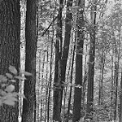
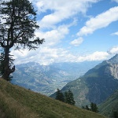
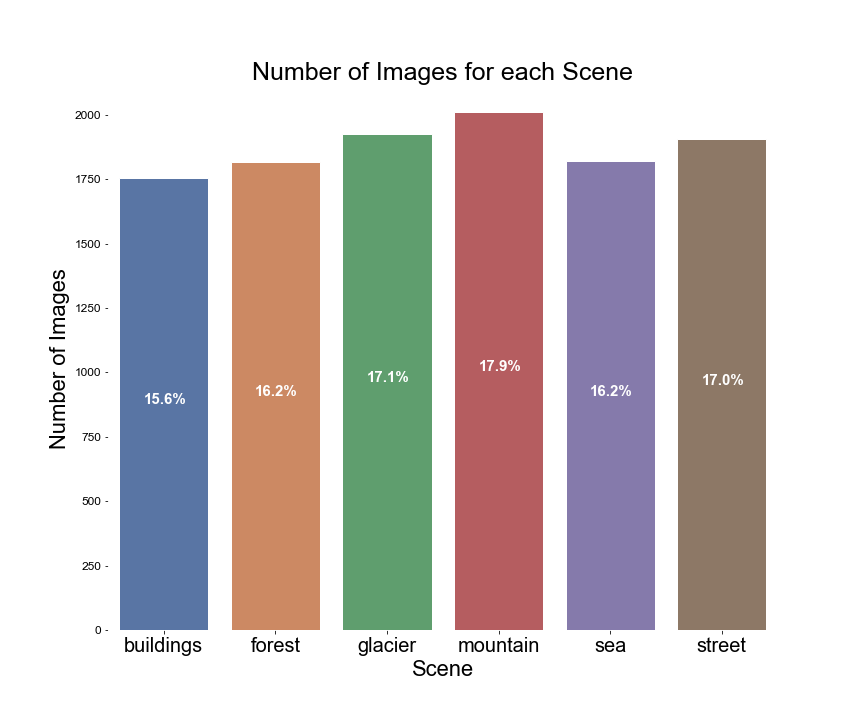

# ***Cene*** - An Image Classification, Organisation Application

*Cene* is an image classification application that aims to classify images of 6 landscapes into corresponding albums.  The landscapes this app is capable of classifying are buildings, forests, glaciers, mountains, seas and streets.  While it is unrealistic that regular users would only have images of these 6 types on their devices, this project aims to create a proof-of-concept application to demonstrate deployment of machine learning image classification models.  

## Why does Image Classification Matter?

Image recognition is a key component of artificial intelligence.  It has wide practical applications in fields such as search engines, robotics, self-driving vehicles, identity recogition security systems and much more.

Image classification has also helped to improve organisation systems.  In the digital age, consumers are able to store thousands of images on their personal devices.  The task of manually sifting through personal photos to organise them into relevant categories is an impossible task for the everday user.  However, this process can be automated by employing machine learning models such as deep neural networks and convolutional neural networks.  

## The Process

This project follows the CRISP-DM method, common to a lot of data science projects.  Included in this [report](reports/final_report.ipynb), you will find details on:
- Business and Data Understanding 
- Data preparation and preprocessing 
- Model iterations
- Evaluation of models and findings
- Deployment of best model through a web application (not included in this current version of the project)

## Repository Navigation

Below you'll find the structure of this repository.  Folders marked in `<directory>` are not folders that you will find in this repo when you clone it but will be created once you follow the reproducability steps to download the data as well as when you run the cells to save your model. 

- The [`notebooks`](notebooks) directory includes subdirectories of [exploratory](notebooks/exploratory) work and [modeling](notebooks/modelling) iterations.  
- The [`figures`](figures) directory contains all images used through this README, final notebook and slide presentations.  
- [`reports`](reports) includes the [final notebook report](reports/final_report.ipynb).  Running this final notebook will allow you to download the data, reproduce all eda and modeling steps.  It also includes commentary at each step.
- The [`reports`](reports) folder also includes the [slide deck](reports/final_presentation_slides.pdf) of the final presentation. 
- The [`src`](src) folder includes code for functions used throughout the project
- the [`environment.yml`](environment.yml) file is also provided for your convenience.
```
.
├── <data>
│   ├── seg_train
│   │   ├── buildings
│   │   ├── forest
│   │   ├── glacier
│   │   ├── mountain
│   │   ├── sea
│   │   ├── street
│   ├── seg_val
│   │   ├── buildings
│   │   ├── forest
│   │   ├── glacier
│   │   ├── mountain
│   │   ├── sea
│   │   ├── street
│   ├── seg_test
│   │   ├── buildings
│   │   ├── forest
│   │   ├── glacier
│   │   ├── mountain
│   │   ├── sea
│   │   ├── street
│   ├── seg_pred
├── figures
├── <models>
├── notebooks
│   ├── exploratory
│   ├── modeling
├── reports
│   ├── final_report.ipynb
│   ├── final_presentation_slides.pdf
├── src
├── environment.yml
```

## Reproduction

### Conda Environment

Provided in this repo is a `.yml` file which includes the environment used to produce the results in this project.  For instructions on how to create an environment from a `.yml` file, please see the link [here](https://docs.conda.io/projects/conda/en/latest/user-guide/tasks/manage-environments.html#creating-an-environment-from-an-environment-yml-file)

### Getting the Data

After forking and/or cloning this repo, create a `data` directory in the root of the repo.  In your terminal (while in the repo directory), run this:

>`! git mkdir data`

Next, download the data to your computer by [clicking here](https://www.kaggle.com/puneet6060/intel-image-classification/download).  

From here, open the zip file.  When you open the zip file, the resulting folder will have this structure:
```
.
├── 111880_269359_bundle_archive
│   ├── seg_train
│   │   ├── seg_train
│   │   │   ├── buildings
│   │   │   ├── forest
│   │   │   ├── glacier
│   │   │   ├── mountain
│   │   │   ├── sea
│   │   │   ├── street
│   ├── seg_test
│   │   ├── seg_test
│   │   │   ├── buildings
│   │   │   ├── forest
│   │   │   ├── glacier
│   │   │   ├── mountain
│   │   │   ├── sea
│   │   │   ├── street
│   ├── seg_pred
│   │   ├── seg_pred
```
Note the nested nature of the file structure here.  There are duplicate sets of `seg_test`, `seg_train` and `seg_pred` folders within the first sets of these folders.  Be sure to only copy the second nested versions of `seg_test`, `seg_train` and `seg_pred`.  Copy these 3 folders over to your recently created `data` directory in the repo.  Your data directory should now look like this:

```
.
├── data
│   ├── seg_train
│   │   ├── buildings
│   │   ├── forest
│   │   ├── glacier
│   │   ├── mountain
│   │   ├── sea
│   │   ├── street
│   ├── seg_test
│   │   ├── buildings
│   │   ├── forest
│   │   ├── glacier
│   │   ├── mountain
│   │   ├── sea
│   │   ├── street
│   ├── seg_pred
```

You data is now ready to use and following along in [the final notebook](reports/final_report.ipynb). 


## The Data

The data used for this project was sourced from [Kaggle](https://www.kaggle.com/puneet6060/intel-image-classification).  The data was intially published on [Analytics Vidhya](https://datahack.analyticsvidhya.com) as an image classification challenge and the data was provided by Intel.  The owner of the dataset is [Puneet Bansal](https://www.kaggle.com/puneet6060).

The data consists of 24,034 building, forest, glacier, mountain, sea and street images.  The data is then split up into training and test sets which each contain 6 sub directories of the 6 image classes.  There are 14,034 images in the training set and 3,000 in the test set.  Further to this, the dataset contains 7,000 unlabelled images for predictive testing purposes.  For modeling purposes, the training set was further split in order to create a validation set.  

Here are a few example images from each class:

|Buildings	|Forest	|Glacier|Mountain|Sea|Street|
|---	|---	|---	|---	|---	|---    |
||||||
|

As you can see, not all images are color (although the vast majority happen to be) and there are some unique augmentations to some images as you can see here with the sea image.  One tricky thing about this classification will be getting our model to distinguish between buildings and streets, given that there are usually buildings in the street images and also distinguishing between glaciers and mountains, since these also often look similar.  

After running the data preparation cells in the final notebook, the structure of the data directory  used for modeling throughout this project will look like this:
```
.
├── data
│   ├── seg_train
│   │   ├── buildings
│   │   ├── forest
│   │   ├── glacier
│   │   ├── mountain
│   │   ├── sea
│   │   ├── street
│   ├── seg_val
│   │   ├── buildings
│   │   ├── forest
│   │   ├── glacier
│   │   ├── mountain
│   │   ├── sea
│   │   ├── street
│   ├── seg_test
│   │   ├── buildings
│   │   ├── forest
│   │   ├── glacier
│   │   ├── mountain
│   │   ├── sea
│   │   ├── street
│   ├── seg_pred
```
**Note:**  When downloading the data from Kaggle, the zip file will only contain folders for `seg_train`, `seg_test` and `seg_pred`.  The details of how to create the validation set are provided [in the final notebook](reports/final_report.ipynb).  

The training set (and thus, validation set) classes were fairly balanced.  We can visualize this as follows:



We see from this bar graph that we have relatively balanced classes with the mountain class containing the highest number of images and sea class containing the least.

## Model Evaluations and Next Steps

The models created in the final notebook report are definitely not the best performing models - we can do better.  Due to time constraints and the extended time it took to run later models, I did not have the chance to apply transfer learning as planned.  Future iterations will definitely include this.  Due to overfitting still being present in the model, I will also experiment with other regularization techniques such as L1 and L2 regularization. 

Throughout my model iterations and experiments, the best results I have seen so far were from the model I created in [this notebook](notebooks/modelling/04_modelling.ipynb).  This model performed the best so far with a training accuracy of 0.9191 and validation accuracy of 0.8237.  While the model is still overfitting it is the least amount of overfitting we have seen so far in our modelling.  The validation loss is still erratic in its behaviour and does not show signs of convergence yet.  Investigations into why this is happening and if there is any further data manipulation I could perform will be my next step.  This model was not included in this notebook as I it took 7 hours to run and could not reproduce it in this notebook without rerunning it.  The model has been saved though which you can see in the above-linked notebook.  

Once a model is developed that meets at least 85% accuracy and little to no overfitting, deployment will be the next phase of this project.  I may to create a web application to sort input photos given to the model.  

## Future Developments

The next stages of this project will include further model improvement as well as deployment.  As it stands, our resulting model of this project could still be improved further.  To do this, we will employ transfer learning methods to benefit from models that are already trained on significant datasets.  

Further to this, demo deployment will take place, most likely in the form of a web application that takes a scramble of images (of the 6 relevant classes) and sorts them into albums as per the predicted label.  

A next iteration of this deployment would be to have an 'other' album, so that images of all kinds can be input into the model and the model will place images that are not one of the 6 classes into the 'other' album.  

To get this application in its most useful form, we would train models on more data of more images (or more, utilize models that have already been trained on big data).  

