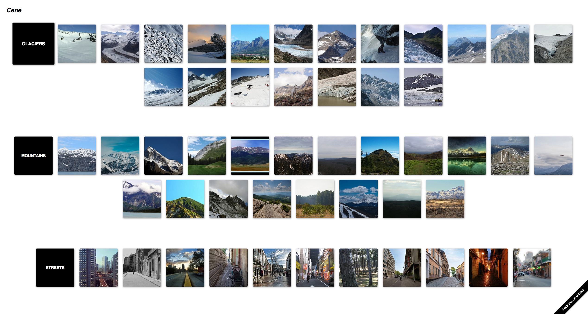

# ***Cene*** - An Image Organisation Application

*Cene* is an image classification application that aims to classify images of 6 landscapes into corresponding albums.  The landscapes this app is capable of classifying are buildings, forests, glaciers, mountains, seas and streets.  While it is unrealistic that regular users would only have images of these 6 types on their devices, this project aims to create a proof-of-concept application to demonstrate deployment of machine learning image classification models.  

## Why does Image Classification Matter?

Image recognition is a key component of artificial intelligence.  It has wide practical applications in fields such as search engines, robotics, self-driving vehicles, identity recogition security systems and much more.

Image classification has also helped to improve organisation systems.  In the digital age, consumers are able to store thousands of images on their personal devices.  The task of manually sifting through personal photos to organise them into relevant categories is an impossible task for the everday user.  However, this process can be automated by employing machine learning models such as deep neural networks and convolutional neural networks.  

## The Data

The data used for this project was sourced from [Kaggle](https://www.kaggle.com/puneet6060/intel-image-classification).  The data was intially published on [Analytics Vidhya](https://datahack.analyticsvidhya.com) as an image classification challenge and the data was provided by Intel.  The owner of the dataset is [Puneet Bansal](https://www.kaggle.com/puneet6060).

The data consists of 24,034 building, forest, glacier, mountain, sea and street images.  The data is then split up into training and test sets which each contain 6 sub directories of the 6 image classes.  There are 14,034 images in the training set and 3,000 in the test set.  Further to this, the dataset contains 7,000 unlabelled images for predictive testing purposes.  For modeling purposes, the training set was further split in order to create a validation set.  

Here are a few example images from each class:

|Buildings	|Forest	|Glacier|Mountain|Sea|Street|
|---	|---	|---	|---	|---	|---    |
||||||


As you can see, not all images are color (although the vast majority happen to be) and there are some unique augmentations to some images as you can see here with the sea image.  One tricky thing about this classification will be getting our model to distinguish between buildings and streets, given that there are usually buildings in the street images and also distinguishing between glaciers and mountains, since these also often look similar.  

## The Process

This project follows the CRISP-DM method, common to a lot of data science projects.  Included in this [report](reports/final_report.ipynb), you will find details on:
- Business and Data Understanding 
- Data preparation and preprocessing 
- Model iterations
- Evaluation of models and findings
- Deployment of best model through a web application (not included in this current version of the project)

## Repository Navigation

Below you'll find the structure of this repository.  Folders marked in `<directory>` are not folders that you will find in this repo when you clone it but will be created once you follow the reproducability steps to download the data as well as when you run the cells to save your model. 

- The [`notebooks`](notebooks) directory includes subdirectories of [exploratory](notebooks/exploratory) work and [modeling](notebooks/modelling) iterations.  
- The [`figures`](figures) directory contains all images used through this README, final notebook and slide presentations.  
- [`reports`](reports) includes the [final notebook report](reports/final_report.ipynb).  Running this final notebook will allow you to download the data, reproduce all eda and modeling steps.  It also includes commentary at each step.
- The [`reports`](reports) folder also includes the [slide deck](reports/final_presentation_slides.pdf) of the final presentation. 
- The [`src`](src) folder includes code for functions used throughout the project
- the [`environment.yml`](environment.yml) file is also provided for your convenience.
```
.
├── <data>
│   ├── seg_train
│   │   ├── buildings
│   │   ├── forest
│   │   ├── glacier
│   │   ├── mountain
│   │   ├── sea
│   │   ├── street
│   ├── seg_val
│   │   ├── buildings
│   │   ├── forest
│   │   ├── glacier
│   │   ├── mountain
│   │   ├── sea
│   │   ├── street
│   ├── seg_test
│   │   ├── buildings
│   │   ├── forest
│   │   ├── glacier
│   │   ├── mountain
│   │   ├── sea
│   │   ├── street
│   ├── seg_pred
├── figures
├── <models>
├── notebooks
│   ├── exploratory
│   ├── modeling
├── reports
│   ├── final_report.ipynb
│   ├── final_presentation_slides.pdf
├── src
├── environment.yml
```

## Reproduction

### Conda Environment

Provided in this repo is a `.yml` file which includes the environment used to produce the results in this project.  In your terminal, run the following commands:

> `conda env create -f environment.yml`

> `conda activate cap-env`

For more details and trouble shooting on how to create an environment from a `.yml` file, please see the link [here](https://docs.conda.io/projects/conda/en/latest/user-guide/tasks/manage-environments.html#creating-an-environment-from-an-environment-yml-file)

### Getting the Data

After forking and/or cloning this repo, create a `data` directory in the root of the repo.  In your terminal (while in the repo directory), run this:

>`git mkdir data`

Next, download the data to your computer by [clicking here](https://www.kaggle.com/puneet6060/intel-image-classification/download).  

From here, open the zip file.  When you open the zip file, the resulting folder will have this structure:
```
.
├── 111880_269359_bundle_archive
│   ├── seg_train
│   │   ├── seg_train
│   │   │   ├── buildings
│   │   │   ├── forest
│   │   │   ├── glacier
│   │   │   ├── mountain
│   │   │   ├── sea
│   │   │   ├── street
│   ├── seg_test
│   │   ├── seg_test
│   │   │   ├── buildings
│   │   │   ├── forest
│   │   │   ├── glacier
│   │   │   ├── mountain
│   │   │   ├── sea
│   │   │   ├── street
│   ├── seg_pred
│   │   ├── seg_pred
```
Note the nested nature of the file structure here.  There are duplicate sets of `seg_test`, `seg_train` and `seg_pred` folders within the first sets of these folders.  Be sure to only copy the second nested versions of `seg_test`, `seg_train` and `seg_pred`.  Copy these 3 folders over to your recently created `data` directory in the repo.  Your data directory should now look like this:

```
.
├── data
│   ├── seg_train
│   │   ├── buildings
│   │   ├── forest
│   │   ├── glacier
│   │   ├── mountain
│   │   ├── sea
│   │   ├── street
│   ├── seg_test
│   │   ├── buildings
│   │   ├── forest
│   │   ├── glacier
│   │   ├── mountain
│   │   ├── sea
│   │   ├── street
│   ├── seg_pred
```

You data is now ready to use and following along in [the final notebook](reports/final_report.ipynb). 

After running the **data preparation cells** in the final notebook, the structure of the data directory  used for modeling throughout this project will look like this:
```
.
├── data
│   ├── seg_train
│   │   ├── buildings
│   │   ├── forest
│   │   ├── glacier
│   │   ├── mountain
│   │   ├── sea
│   │   ├── street
│   ├── seg_val
│   │   ├── buildings
│   │   ├── forest
│   │   ├── glacier
│   │   ├── mountain
│   │   ├── sea
│   │   ├── street
│   ├── seg_test
│   │   ├── buildings
│   │   ├── forest
│   │   ├── glacier
│   │   ├── mountain
│   │   ├── sea
│   │   ├── street
│   ├── seg_pred
```
**Note:**  When downloading the data from Kaggle, the zip file will only contain folders for `seg_train`, `seg_test` and `seg_pred`.  The details of how to create the validation set are provided [in the final notebook](reports/final_report.ipynb).  

The training set (and thus, validation set) classes were fairly balanced.  We can visualize this as follows:


We see from this bar graph that we have relatively balanced classes with the mountain class containing the highest number of images and sea class containing the least.

## Modeling

[Within the final notebook](reports/final_report.ipynb), a first simple neural network model using a basic keras Sequential model with Dense layers will be created to get a baseline performance.  You will see that this model did not perform any better than random chance, which an accuracy score of roughly 15% - this is the kind of behaviour I would expect for an FSM.  Next I iterate upon this model using convolutional neural networks (CNNs) to try to achieve higher results which I do in model 6.  

### Metrics

My aim for this model is that it classifies images as accurately as possible.  There is no benefit towards seeing less false negatives over false positives and visa versa since both scenarios result in a misclassification.  For this reason, I choose to optimize for accuracy.  

### Success Criteria 

For these models, I aim to create a model that performs at, at least 85% accuracy and that also shows little-to-no overfitting.  

## Model Evaluations

The final model declared in this notebook performs quite well and classifies images with an 81% test accuracy.  However, I believe the performance is actually better than this given some of the class similarities.  It is often difficult, for even a human, to distinguish between some of the `glacier` and `mountain` images and also between the `street` and `building` images.  The majority of misclassifications are usually mountains being classified as glaciers (and visa versa) and streets being classified as buildings (and visa versa).  For the goals of this project, which is to organize user's photos, I think these misclassifications would actually still achieve our goal of image organization.

Due to time constraints and the extended time it took to run later models, I did not have the chance to apply transfer learning as planned.  Future iterations will definitely include this.  Due to overfitting still being present in some models, I will also experiment with other regularization techniques such as L1 and L2 regularization. 

As you will see in my [final notebook](reports/final_report.ipynb), my best model was a convolutional neural network with 6 hidden layers and achieved a training accuracy score of 0.8888 and a test accuracy of 0.8100.   

## Deployment 

In [the deployment folder](deployment) of this repo, you will find the web application to run locally on your own computer.  In your terminal while in this repo directory, run the following commands to use/see the demo application as it stands:

>`cd ./deployment`

>`python main.py`

Then, copy and paste the `http:` address shown on the line that says `Running on http//<your_port_numbers>` into your chosen browser.  

This is a demo application and classifies one set of images which can be found [here](deployment/static/images/imgs).  For demonstration purposes, I have produced the predictions of these images ahead of time and pickled them into a [dictionary](deployment/predictions/demo_preds.pickle).  Details on how this prediction dictionary was created can be found in [this notebook](deployment/01_pickle_preds.ipynb).

Here are some screen shots of the application:




## Future Developments

The next stages of this project will include further model improvement where I with to employ transfer learning methods in order to benefit from models that are already trained on significant datasets.  

A next iteration of deployment would be to have an 'other' album, so that images of all kinds can be input into the model and the model will place images that are not one of the 6 classes into the 'other' album.  Alternatively, to minimize misclassifications, I could add a probability threshold, that an image is only included in a particular album if it is '80% sure' that that image is of that class (for example).  Further to this, I think it might be worthwhile to create either a sub-category system where image classes that are similar (such as the moutain/glacier and street/building classes) or to just group these classes together and just have a 'mountain' folder and a 'buildings' folder for example.  

To get this application in its most useful form, we would train models on more data of more images (or more, utilize models that have already been trained on big data) so that I can get the model to categorize more classes of images.  

As far as functionality goes, I would like to add an `upload` platform for users to upload their own images - this makes the most sense for users!